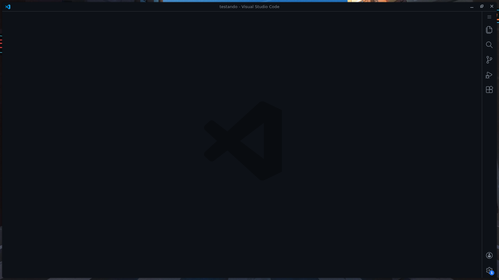
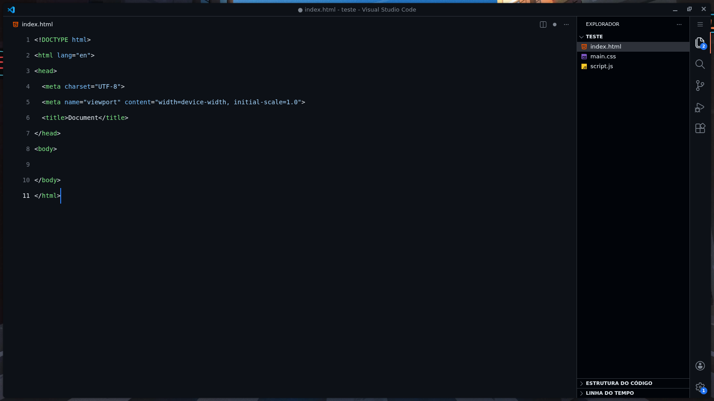

# 🎨 VSCode Minimalistic

A **clean, modern and minimalistic Visual Studio Code setup** focused on productivity, readability and a smooth developer experience.

Perfect for developers who love a **simple interface**, distraction-free coding and a professional look ✨

---

## 🖼️ Preview

  

  

---

## 🚀 Features

- 🧼 Clean and minimal UI  
- 🌙 Soft colors, easy on the eyes  
- ⚡ Fast and lightweight setup  
- 🧠 Improved focus and readability  
- 🎯 Perfect for long coding sessions  

---

## 📦 Requirements

Make sure you have the following extensions installed:

### 🎨 Theme
- **GitHub Theme**  
  🔗 https://marketplace.visualstudio.com/items?itemName=GitHub.github-vscode-theme

### 🗂️ Icons
- **Material Icon Theme**  
  🔗 https://marketplace.visualstudio.com/items?itemName=PKief.material-icon-theme

---

### 📥 How to Install

Follow the steps below to apply this minimalistic setup in your VS Code:

### 1️⃣ Copy the settings
- Copy the content inside the `settings.json` file from this repository

### 2️⃣ Open VSCODE
- Open **Visual Studio Code**
- Press **F1** (or `Ctrl + Shift + P`)

### 3️⃣ Open User Settings (JSON)
- Search for: Open User Settings (JSON)

### 4️⃣ Paste and save
- Paste the copied content into the file
- Save the file

✅ Done! Your VS Code is now using the **VSCode Minimalistic** setup ✨

